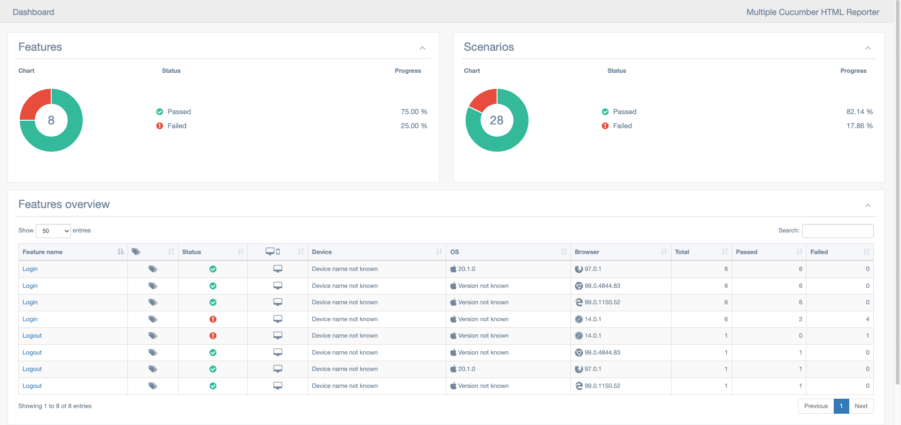
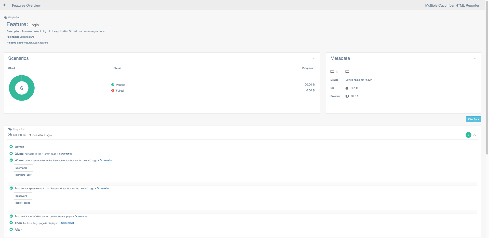
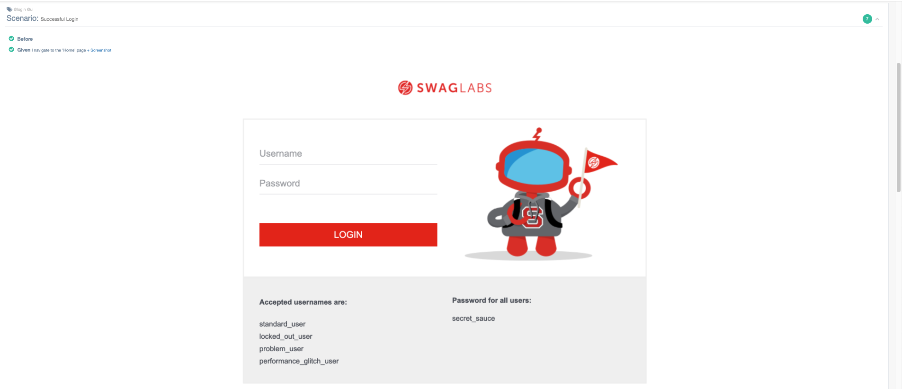

# Enterprise level test framework for web applications in typescript

<b>Application under test</b>

```
https://www.saucedemo.com
```

<b>Prerequisites</b>

```
node >=12.6.1
Google Chrome
Microsoft Edge
Safari
Mozilla Firefox
```

<b>To install dependencies</b>

```
npm install
```


<b>To run the tests</b>

```
npx wdio run ./wdio.conf.ts
```
*Some safari tests might be flaky due to wait/sync issues and need to be fixed.

<b>To run the tests in headless mode</b>

```
HEADLESS=headless npx wdio run ./wdio.conf.ts
```
*Safari does not support headless mode.

<b>Test report with screenshots as test evidence embedded beneath each test step</b>

```
open .tmp/report/index.html in a browser
```

<b>BDD</b> :heavy_check_mark:  
<b>Cross Browser</b> :heavy_check_mark:  
<b>Parallel run</b> :heavy_check_mark:  
<b>Page Object Pattern</b> :heavy_check_mark:

<b>Tech Stack</b>

```
WDIO
Cucumber
Typescript
```

<b>Sample Test Report</b>




